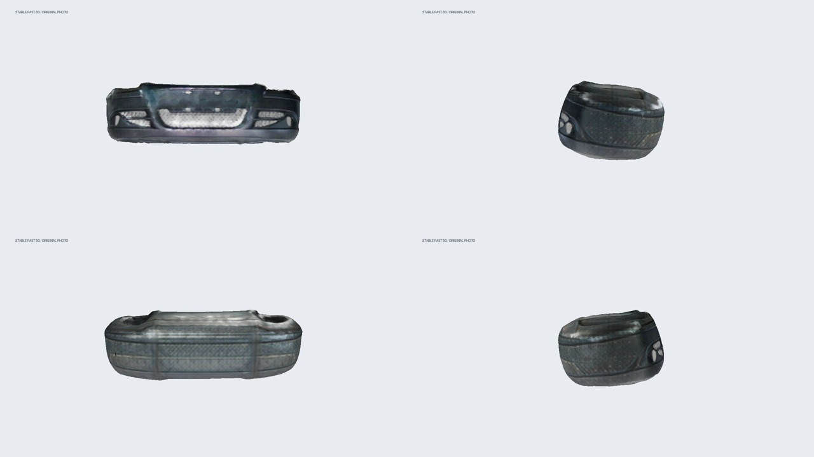

# stable-diffusion-img2pcd

[trellis2-img2pcd](https://github.com/biop99999111/trellis2-img2pcd)의 이력을 유지한 Stable Diffusion 스파이크용 파생 저장소입니다. 동일 계정 소유 저장소에서 분리했으므로 GitHub의 fork 표시가 붙는 포크는 아닙니다.

**사진을 SDXL로 변형한 뒤 기존 3D 모델에 넣어 PCD를 만드는 실험**과 **Stable Fast 3D 직접 비교 실험**을 제공합니다.

원본 사진에 SF3D를 직접 적용하는 재현 가능한 실행·검증·영상 명령은 [SF3D_RUNBOOK.md](SF3D_RUNBOOK.md)를 참고하세요. `sf3d_workflow.py`는 모델 revision·입력 해시·환경을 기록하고 GLB/PCD 검증을 수행합니다. **2026-09-08 RTX 4090에서 실제 SF3D 생성·텍스처·PCD 검증을 완료했습니다. 파일 검증은 통과했지만 범퍼 형상은 FAIL이며 시각적 품질도 제한적입니다.**

## SF3D 실제 범퍼 결과 — 2026-09-08

원본 `inputs/bumper.jpg`를 직접 입력했다. SDXL 변환은 사용하지 않았다. 결과 파일과 재현 기록은 [artifacts/sf3d_bumper_01](artifacts/sf3d_bumper_01)에 보관한다.



- [12초 회전 영상](artifacts/sf3d_bumper_01/video/bumper_turntable.mp4)
- [텍스처 GLB](artifacts/sf3d_bumper_01/bumper_cover/mesh.glb) · [mm 메시](artifacts/sf3d_bumper_01/bumper_cover/mesh_mm.ply) · [색상 PCD](artifacts/sf3d_bumper_01/bumper_cover/bumper_cover.pcd)
- [전처리 입력](artifacts/sf3d_bumper_01/bumper_cover/input_nobg.png) · [실행 manifest](artifacts/sf3d_bumper_01/bumper_cover/manifest.json) · [검증 결과](artifacts/sf3d_bumper_01/bumper_cover/validation.json)

| 항목 | 실제 기록 |
|---|---|
| 환경 | RTX 4090, Python 3.10, torch 2.5.1+cu124, nvcc 12.8 |
| 실험 코드 / SF3D 소스 | `61dfe11` / `ff21fc491b4dc5314bf6734c7c0dabd86b5f5bb2` |
| 모델 revision | `f0c9a8ffd62cb1bbc8a7a53c9f87a0be1b6be778` |
| 설정 | 텍스처 1024, seed 42, remesh none, 스무딩 없음 |
| 로딩 / 전처리 / 생성 | 54.128초 / 4.944초 / 1.219초 |
| peak allocated VRAM | 5.995GiB |
| 메시 | 정점 16,040 / 면 23,112, UV·텍스처 있음 |
| PCD | 색상 포함 300,000점, 4.58MiB |
| bbox 길이순 | 1750 / 882.1 / 588.4mm |
| 대략 기준 대비 비율 | 1.00 / 1.96 / 1.68 → 형상 FAIL |
| 영상 | 1280×720, 30fps, 12초, 360프레임 전체 디코딩 통과 |

1.219초는 백엔드의 생성 단계 시간으로, 다운로드·모델 로딩·PCD 처리·영상 제작을 포함하지 않는다. 첫 실행의 로딩·전처리에는 보조 모델 다운로드가 포함될 수 있다. SF3D 본체 snapshot 다운로드는 새 서버에서 190.4초였고, DINOv2와 rembg U2Net도 초기 로딩 과정에서 다운로드했다. 이전 서버에서 연결 중단을 경험하여 임시 캐시를 보존하는 최대 6회 다운로드 시도를 추가했다. 서버 간 차이만으로 Hugging Face 또는 vast.ai 전체의 장애를 단정하지 않는다.

### 품질이 낮게 보이는 이유와 한계

**관찰:** 정면 범퍼 실루엣은 유지되지만 측면·후면이 두껍고 둥근 덩어리처럼 생성됐다. 후면에는 그릴과 유사한 무늬가 반복되고 정면 텍스처도 흐리다. 파일 저장 오류가 아니라 생성된 형상 자체에서 확인되는 문제다.

**원인 가설:** 단일 정면 사진은 보이지 않는 후면·깊이·얇은 벽 두께에 대한 제약이 부족하다. 입력은 검은색 부품과 작은 그릴 디테일을 포함하며, 전처리 이미지에는 그릴 내부의 흰 배경이 남아 보인다. 모델이 이를 표면 무늬로 복원했을 가능성이 있다. 이 원인별 영향은 추가 실험으로 검증해야 한다. 1024 텍스처는 세부 표현의 한 요인일 수 있지만 2048로 올리기만 해서는 두꺼운 후면 형상이 해결된다고 보장할 수 없다.

**판정 구분:** validation의 `passed=true`는 메시·UV·텍스처·PCD 파일 계약을 통과했다는 의미다. 현실 형상 정확도를 뜻하지 않는다. 1750mm는 최장축 강제 스케일이며 `[1750,450,350]`도 대략 기준이다. bbox 길이를 정렬해서 비교하므로 실제 폭·높이·깊이와 동일시하지 않는다. 계측 활용은 미검증이다.

**다음 실험:** 그릴 내부까지 검토한 마스크를 별도 입력으로 보존하고 원본과 비교한다. 2048 텍스처는 세부색 개선만 별도 평가한다. 얇은 범퍼·후면 구조가 필요한 경우에는 추가 시점이나 실제 스캔을 확보해 복원 방식부터 재검토한다. 이 후속 실험은 아직 수행하지 않았다.

로컬 영상은 원본 GLB를 직접 읽어 정면 시작각 180도로 렌더링했다. 간단한 PBR 렌더러이므로 조명에 따른 색 인상은 달라질 수 있지만 후면 부풀림 자체는 메시의 특징이다.

### 핵심 목표: 이미지 기반 합성데이터의 유효성

목표는 보기 좋은 회전 영상 자체가 아니라 **이미지를 출발점으로 학습에 유효한 합성데이터를 만들 수 있는지 검증**하는 것이다. 이번 실패는 이 범퍼에 대한 SF3D 단일 실행의 형상 충실도가 낮다는 근거이며, 이미지 기반 합성데이터 전체가 불가능하다는 결론은 아니다.

| 후보 | 출력·역할 | 합성데이터 평가 관점 |
|---|---|---|
| SF3D (이번 실행) | 단일 이미지 → 텍스처 메시 → 렌더·PCD | 형상과 재질을 고정한 렌더/라벨 생성 가능. 이번 메시의 부풀림은 데이터 편향 위험 |
| SV3D (미실험) | 단일 이미지 → 여러 시점 영상/이미지, SV3D_p는 카메라 경로 조건 사용 | 2D 시점 증강 후보. 기본 영상 추론만으로 정밀 메시·깊이·결함 라벨이 확보되지는 않음 |
| SPAR3D 등 별도 3D 복원 후보 (미실험) | 포인트 기반 생성과 메시 복원을 결합하는 등 다른 구조 | 같은 입력에서 후면·얇은 형상이 개선되는지 실제 대조 실험 필요 |

SV3D는 다중 시점 합성을 기반으로 3D 복원에도 활용할 수 있지만, 이미지 시퀀스를 얻는 단계와 메시 복원 단계는 구분한다. “Stable 3D”라는 표현만으로는 특정 체크포인트를 식별할 수 없다. 공식 3D 페이지에는 SF3D·SV3D·SPAR3D·Stable Zero123 등 여러 모델이 소개된다. [SV3D 공식 소개](https://stability.ai/news-updates/introducing-stable-video-3d), [Stability AI 3D 모델 목록](https://stability.ai/stable-3d)

후속 SV3D 실험은 동일 원본의 작은 시점 변화부터 시작하여 실루엣·그릴 구멍·부품 정체성이 유지되는지 검토한다. 결함이 있는 입력에서는 결함의 사라짐·생성·위치 이동을 반드시 검사한다. 생성 프레임에 원본의 결함 마스크를 그대로 복사하지 않는다. 현재 범퍼 정상 사진만으로 결함 합성의 효과까지 검증할 수 없다.

학습 검증은 실제 데이터만 사용한 기준 모델과 실제+합성 데이터 모델을 비교한다. 동일 원본에서 파생된 프레임은 같은 split에 묶고, 별도로 확보한 실제 부품/촬영 데이터에서 과검출·미검출과 목표 지표를 평가한다. 3D 결함 깊이·PCD 라벨이 목적이면 CAD/스캔 등의 검증된 기준 형상에 제어 가능한 변형을 적용하는 경로도 비교한다. 이 실험 설계는 제안이며 SV3D/SPAR3D 설치·성능 검증은 아직 수행하지 않았다.

| 경로 | 실행 | 확인할 것 |
|---|---|---|
| 원본 사진 → Hunyuan3D / TRELLIS → PCD | `img2pcd.py` | 기존 대조군 |
| 원본 사진 → SDXL img2img → 같은 3D 모델 → PCD | `sd_spike.py` 후 `img2pcd.py` | SD 전처리에 따른 형상·색 변화 |
| 원본 사진 → Stable Fast 3D → PCD | `img2pcd.py --backend sf3d` | 3D 복원 모델 자체 비교 |

SDXL은 2D 이미지 모델이며 PCD를 직접 출력하지 않습니다. Stable Fast 3D는 Stability AI의 별도 feedforward 3D 복원 모델이며 Stable Diffusion과 같은 모델이 아닙니다. [SDXL 공식 문서](https://huggingface.co/docs/diffusers/v0.35.1/en/using-diffusers/sdxl), [SF3D 공식 저장소](https://github.com/Stability-AI/stable-fast-3d).

## 1. SDXL 스파이크 (Linux / vast.ai)

CUDA 12.4용 PyTorch를 설치하는 스크립트입니다. 기존 실험과 같은 RTX 4090급 환경을 대상으로 작성했으며 GPU 추론·설치는 아직 실측 검증하지 않았습니다. SDXL과 3D 모델은 서로 다른 conda 환경과 프로세스에서 실행합니다.

```bash
git clone https://github.com/biop99999111/stable-diffusion-img2pcd.git
cd stable-diffusion-img2pcd
bash setup_sd.sh
conda activate sdxl-spike

# 입력 파일, 설정, 이미지 디코딩 확인. 모델 다운로드/GPU 호출 없음
python sd_spike.py --dry-run

# 동일 사진, 낮은 변형 강도, seed 3개로 비교
python sd_spike.py --only bumper_cover --seeds 42 43 44 --strength 0.25 --out out_sd_images
```

`parts.yaml`의 이미지와 치수를 사용합니다. `--prompt`, `--negative-prompt`, `--steps`, `--guidance`, `--size`로 실험을 바꿀 수 있습니다. 기본 모델은 `stabilityai/stable-diffusion-xl-base-1.0`, 1024px, 30 steps입니다. 원본 비율을 유지해 흰색 패딩을 추가하고 투명 이미지도 흰 배경에 합성합니다. seed는 SD 이미지 생성에만 적용되고 후속 3D/샘플링 seed는 설정값을 유지합니다.

```text
out_sd_images/
  bumper_cover_input.png       SDXL 입력(패딩 적용)
  bumper_cover_sd_s42.png      변형 이미지(seed별)
  parts_baseline.yaml          원본 사진 대조군 설정
  parts_sd.yaml                변형 이미지 설정
  sd_manifest.json            프롬프트·seed·입력 SHA256·시간·VRAM·완료 여부
```

결과 혼합을 막기 위해 출력 폴더는 비어 있어야 합니다. 오류 발생 후에는 새 `--out` 경로를 사용하세요. 생성된 YAML의 이미지 경로는 절대 경로이므로 같은 머신에서 후속 처리를 실행합니다. 다른 머신으로 옮기면 YAML 경로도 수정해야 합니다.

### 같은 3D 모델로 대조군과 비교

```bash
bash setup_hunyuan3d.sh       # 미설치 시 한 번
conda activate hunyuan3d
python img2pcd.py --config out_sd_images/parts_baseline.yaml --out out_baseline
python img2pcd.py --config out_sd_images/parts_sd.yaml --out out_sd_pcd
```

양쪽 `run.json`의 `shape_check`, `bbox_mm`, `verify`와 부품별 `preview.png`를 비교합니다. `target_mm`로 최장축을 강제 보정하므로 그 축이 맞는 것만으로 형상이 정확하다고 판정하지 않습니다. `expect_mm`의 나머지 축과 최소축 배율도 확인해야 합니다. 기본 치수는 대략치이므로 실제 측정값으로 교체하세요.

SDXL은 외형을 바꿀 수 있습니다. 원본 사진 대조군과 비교하는 이 실험은 SDXL 전처리의 효과를 평가하며 3D 모델 교체 실험과 구분됩니다. 낮은 strength와 형태 유지 프롬프트도 치수 보존을 보장하지 않습니다. 세밀한 0.1~1mm 결함 계측 정확도는 별도 실측이 필요합니다.

## 2. Stable Fast 3D 직접 비교

[모델 페이지](https://huggingface.co/stabilityai/stable-fast-3d)에서 접근 권한을 받은 Hugging Face 계정의 토큰을 `HF_TOKEN`으로 설정하세요. 설치 스크립트는 CUDA 확장 빌드 전에 모델 설정 파일 접근부터 확인합니다. 모델 사용 조건은 해당 모델 페이지를 따릅니다.

```bash
export HF_TOKEN=hf_...       # 실제 토큰은 커밋하지 않음
bash setup_sf3d.sh          # conda + nvcc 있는 Linux CUDA devel 환경
conda activate sf3d-spike
python img2pcd.py --backend sf3d --out out_sf3d
```

기본 소스 위치는 형제 폴더 `stable-fast-3d`입니다. `--repo-dir` 또는 `SF3D_DIR`로 지정할 수 있습니다. SF3D는 알파가 없으면 배경을 제거하고, foreground ratio 0.85로 패딩 후 텍스처 메시를 생성합니다. `--texture` 없이도 색을 생성합니다. 텍스처 해상도는 `parts.yaml`의 `texture_size`를 사용합니다. 재메싱 옵션 예:

```bash
python img2pcd.py --backend sf3d --run-kwargs '{"remesh":"triangle","vertex_count":10000}' --out out_sf3d_remesh
```

SDXL→SF3D를 실험하려면 이미지 생성 시 `--backend sf3d`를 주고, 출력 YAML을 `sf3d-spike` 환경의 `img2pcd.py`에 전달하면 됩니다.

SF3D API는 [공식 run.py](https://github.com/Stability-AI/stable-fast-3d/blob/main/run.py)를 기준으로 작성했습니다. `setup_sf3d.sh`는 설치된 SF3D commit을 출력합니다. upstream 소스 설치는 고정 커밋이 아니므로 재현 실험 시 해당 commit도 보관하세요.

## 검증 상태

### Hunyuan 텍스처 단계 복구 (Python 3.10)

`ModuleNotFoundError: No module named 'bpy'`는 구형 설치 스크립트에서 bpy를 제외한 경우 발생합니다.
[Blender 공식 안내](https://pypi.org/project/bpy/)에 따라 보관소에서 설치합니다.

```bash
conda activate hunyuan3d
python -m pip install 'numpy<2' 'bpy==4.0.0' --extra-index-url https://download.blender.org/pypi/
python -c 'import bpy; print(bpy.app.version_string)'
git pull --ff-only
python img2pcd.py --config out_sd_bumper_01/parts_sd.yaml --texture-only --out out_sd_textured_01
```

`--texture-only`는 해당 출력 폴더의 `mesh_shape.glb`와 `input_nobg.png`를 재사용하며 shape 모델을 로드하지 않습니다.
원본 형상과 대응하는 이미지 설정으로만 재개하세요. OBJ·MTL·텍스처 중간 파일은 부품 폴더의 `paint_*/`에 보존됩니다.
텍스처 경로는 OBJ를 생성하고 Blender로 GLB 변환 후 바이너리 헤더 검증을 통과한 파일만 `mesh.glb`로 채택합니다.
모델 설정·RealESRGAN 가중치 경로는 Hunyuan 소스 기준 절대 경로로 지정합니다.

### CPU 검사

BasicSR 1.4.2는 삭제된 `torchvision.transforms.functional_tensor` 경로를 참조합니다.
Hunyuan 텍스처 실행 시 해당 모듈이 없는 경우에만 공개 API의 `rgb_to_grayscale`에 연결합니다.
설치 패키지나 torch/torchvision 버전은 변경하지 않습니다.
`python -m unittest test_basicsr_compat -v`로 import 호환 동작 3개를 검증합니다.

Hunyuan의 `simplify_quadric_decimation(target_count)`는 최신 trimesh에서 면 개수를 감소 비율로 해석합니다.
텍스처 실행 시 설치된 Hunyuan 단순화 함수의 해당 호출만 `face_count=target_count`로 변경합니다.
원본 소스 파일은 수정하지 않으며 전처리와 목표 면 개수는 유지합니다.
`python -m unittest test_decimation_compat test_basicsr_compat test_sd_spike -v`의 CPU 검사 17개가 통과했습니다.

```bash
python -m unittest test_sd_spike -v
python smoke_test.py
```

- CPU 테스트 11개 통과: 입력 비율·투명도, 잘못된 설정, seed·설정·manifest, SF3D 호출 계약, 실제 GLB→PCD 통합, Hunyuan 텍스처 재개·GLB 검증.
- 기존 CPU 스모크 테스트 12/12 통과, 실제 범퍼 사진의 SDXL `--dry-run` 통과.
- 위 CPU 검사의 모델 호출은 모의 객체입니다. SF3D 실제 GPU 검증은 상단의 2026-09-08 결과를 참고하세요. SDXL→Hunyuan 이전 실험과 이번 원본→SF3D는 입력 조건이 다르므로 같은 입력의 성능 비교로 해석하지 않습니다.
- `sd_manifest.json`의 시간은 SDXL 단계, 부품 `manifest.json`의 시간은 3D 단계입니다. VRAM은 PyTorch allocated peak이며 드라이버 전체 사용량과 다릅니다.

원본 Hunyuan3D 실측 결과와 TRELLIS 설치 기록은 [README_UPSTREAM.md](README_UPSTREAM.md), [HANDOFF.md](HANDOFF.md)에 보존했습니다. 해당 실측은 이번 SDXL/SF3D 결과가 아닙니다. 기존 `track_a/` 스캔 기반 결함 합성도 유지합니다.
